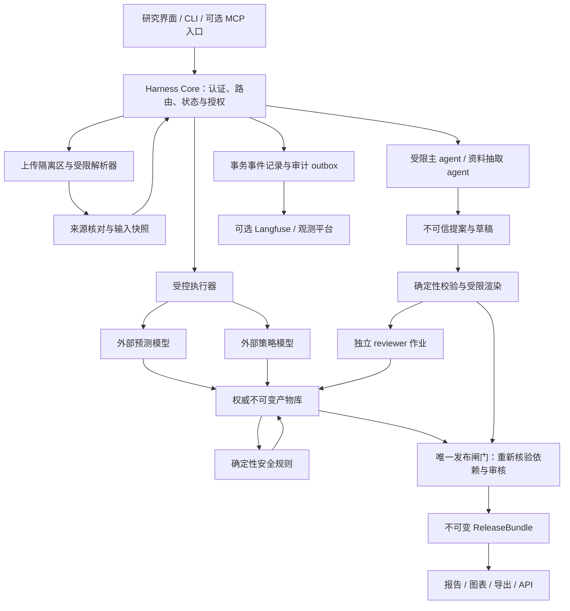

# 糖尿病多模态分析 Agent：以证据产物和发布权为核心的强约束 Harness

版本：v3.5（明确callback驱动进化与双模型唯一判据的执行边界）  
日期：2026-09-09  
状态：设计方案，尚未实现或完成运行验收  
首版用途：**公开数据集上的毕业设计与研究演示，不面向新用户或真实诊疗**（本轮用户已确认）
职责：**给药建议来自 RL 模型；LLM 汇总全部结果为自然语言，并附有证据和不确定性说明的诊疗意见；医学伦理是必需验收项。**  
原稿：`../原始材料/diabetes_agent_harness_sdk_deepseek_plan.md`

## 1. 结论与本次修订范围

方案值得做，研究主体应当是“可信产物如何产生、绑定、失效、审核及发布”，而非 MCP、SDK、RAG、subagent 的组合数量。原稿已有正确方向，但示例代码与安全声明不一致，尚不能据此称为强 Harness。

用户提出的“只有两个模型的输出才能过闸门”应保留并精确定义：**在策略分析路径上，预测字段只能源于受控预测执行，策略字段只能源于受控策略执行；后者依赖前者的同一输入快照。二者通过来源、适用性、数据质量和安全规则检查，才能进入相应后续节点。** 成功推理是必要条件，不是医学正确或可执行的充分条件。

CLI 很适合成为研究运行器，但 CLI、MCP、HTTP、函数调用都只是入口/传输形式。强约束来自被 agent 权限隔离的控制内核、受控执行器、权威产物库和唯一发布端。主 agent、subagent、模型回复、工具返回文本都没有签发可信事实和发布报告的权限。

本次只设计两个外部模型的接入契约、来源校验、错误处理及依赖关系，不涉及模型训练、网络结构、奖励函数、权重导出格式或效果承诺。正式实验使用用户选定的公开数据集；模型尚未接入时用明确标记的合成 fixture 做工程故障测试，不替代公开数据实验，也不得把 fixture 演示称为真实推理。

成品愿景保留：用户能上传血糖、病历、检验单、图片和生理信息，系统进行有依据的综合分析并形成可追溯报告。首版用研究者和公开数据集中的病例模拟该体验；不把它定位为已经能替代医生的“数字孪生医生”，也不承诺真实闭环给药。

## 2. 第一性原理：究竟要约束什么

一次可信分析至少要回答五个问题：数据从哪里来；实际做了哪些计算；这些计算是否适用于此病例；文字是否忠实于证据；最终谁有权把哪一版内容展示出去。

因此要分开四种性质：

| 性质 | 能证明什么 | 不能证明什么 |
| --- | --- | --- |
| 结构有效 | 字段、类型、单位、必填项满足契约 | 不是编造或来源真实 |
| 来源有效 | 结果由被授权执行路径登记，绑定本次输入 | 模型一定准确或用户上传内容一定真实 |
| 程序有效 | 所有规定前置条件、权限、版本、审核均满足 | 临床安全规则覆盖全部风险 |
| 临床有效 | 经合适数据和专家/临床研究支持特定用途 | 不由前面三项自动推出 |

Harness 控制的是**计算机允许的状态、资源访问和公开输出**，不能强迫 LLM 的内部思考永远正确。允许 LLM 私下产生错误草稿；未满足验收条件的草稿不得获得正式产物身份、不得写入可信事实、不得到达产品输出通道。未被语义审核识别的错误仍是需要实验测量的残余风险。

对开放自然语言，“绝不产生错误医疗含义”不是可以靠 JSON Schema、正则或两个 reviewer 证明的性质。首版应缩小可以自动发布的语言范围，将硬保证放在类型化事实、依赖链和模板渲染上。

## 3. 产品范围与风险路由

不能让每个提问都经过预测和胰岛素策略。策略服务故障不应阻止解释“文件格式错误”，更不能阻止预先审定的紧急求助提示。

| 路径 | 触发/用途 | 必须具备的证据 | 不得借此发布 |
| --- | --- | --- | --- |
| `DATA_STATUS` | 上传进度、缺字段、失败说明 | 控制器事件/验证结果 | 预测、策略、诊疗意见 |
| `EDUCATION` | 通用概念解释 | 审定知识条目与模板 | 个体化用药或风险判定 |
| `OBSERVATION` | 描述已上传血糖及统计摘要 | 验证后的观测快照、确定性统计结果 | 未来预测、策略模型结果 |
| `PREDICTION` | 未来血糖研究分析 | 输入合格、预测产物、预测发布规则、必要语义审核 | 策略/剂量 |
| `POLICY_RESEARCH` | 研究策略链路 | 同一快照的预测→策略→安全产物、审核、发布许可 | 实际处方、给药动作 |
| `ESCALATION` | 预先定义的风险信号或无法排除风险 | 版本化规则和审定提示模板 | 擅自推断病因或补出治疗剂量 |

路径不是让 LLM 自报一个低风险标签就算数。请求路由、输出 schema、可用模板及可引用字段由 Core 授权；分类不确定时补问或进入较保守路径。即使误分类到 EDUCATION，其发布类型也没有承载预测/剂量字段的能力。

`ESCALATION` 是信息提示路径，不是绕过闸门的处方路径。具体触发规则及措辞需医学专家审定；本方案不自行设定临床阈值。对公开历史数据，该路径展示“在病例所处时点应触发的研究风险提示”，不能对历史病例误报当前紧急情况。系统不可用时也不能把“无法评估”显示成“风险低”。

首版允许在**已发布的研究报告**内展示来源有效的策略候选数值，持续标明“研究候选，不用于实际用药”，无设备接口。未经过安全规则的候选仅进入授权的研究调试视图；不混入用户报告。安全拒绝时，正式报告的建议字段必须为空；拒绝的原始候选保留在隔离审计数据中供分析。

## 4. 威胁模型和保证边界

覆盖的对手/故障：恶意用户文本、病例/PDF/图片/RAG 间接注入；主 agent 编造或越权；reviewer 被草稿诱导；伪造或重放结果；服务超时、异常、错误成功码；重复请求、并发、取消后迟到结果；输入更新及版本漂移；跨病例/跨研究作业读取；UI、导出和缓存泄漏。

可信计算基包括：Core 的权限及状态逻辑、产物验证器、执行器身份与密钥管理、数据库事务、规则包验证、受限渲染器、发布 API，以及支撑隔离的 OS/运行环境。必须尽量小，接受代码审查和独立测试。

LLM、OCR/VLM、RAG 文本、reviewer 的语义结论均为概率性/不可信内容。预测与策略模型是**被授权的数值生产者**，仍可能输出错误、过期或不适用的结果，必须继续验证。

以下不作首版保证：有管理员权限的人篡改控制器/密钥/OS 后仍无法伪造；已被攻陷的受信推理服务仍诚实运行；任意开放医疗自然语言零幻觉；合成病例成绩代表临床有效性。

独立进程只提供故障隔离，不自动提供权限隔离。同一系统账号下的恶意进程可能读文件、访问凭据或调试别的进程。若 agent 获得 shell/任意代码能力，必须有实际 OS 沙箱、独立身份、挂载与网络隔离；否则不能声称可抵御该权限级别的攻击。首版 agent 节点不授予 shell、通用文件写入或任意网络工具。

## 5. 推荐架构：控制器 + 证据产物 + CLI



MVP 部署采用一个 Core 服务（含事务库、规则、执行调度和发布），以及受限的解析/LLM worker。外部模型由受控 adapter 调用本地库或远程服务，按模型提供方真实部署选择，不预设 ONNX/CPU/内嵌权重。Core 内部组件可以在同一可信进程，但不能把不可信任意代码插件放进它。

CLI 是该服务的薄客户端；MCP 若保留，也调用同一服务。内核根据调用者身份授权，而不是根据 CLI 子命令名或 MCP tool 描述授权。Web/桌面界面也没有直写状态库、验签密钥或签发产物的权限。

当前工程栈确定为：Python Core + 严格schema + SQLite + Claude Agent SDK runtime adapter + DeepSeek Pro主模型 + 本地桌面App + Agent Observation观测适配。SDK负责有界的agent loop、会话、工具和Hook；Core负责强制前置条件与发布。兼容性在开工早期实测，保留adapter边界以便处理不兼容，不将SDK品牌当安全保证。

## 6. CLI 与 MCP 的具体边界

以下是**拟议接口**，当前没有实现这些命令：

```text
dh case create --input-manifest synthetic-case.json
dh run start --case CASE_ID --mode policy-research
dh run status --run RUN_ID
dh artifact inspect --id ARTIFACT_ID
dh report get --release RELEASE_ID
dh eval run --suite adversarial-v1
```

`run start` 请求 Core 运行流程，不是让 agent 自行串命令。`artifact inspect` 只读，并按授权脱敏；`report get` 只能读取已提交 release。受限 agent 通常只需 `submit_proposal(job_id, proposal)` 一种能力。

不暴露 `mark_prediction_done`、`set_safety_approved`、`review --verdict pass --as ethics`、`finalize --force`、`skip_step`、`import_trusted_result` 等运行时逃生口。测试 fixture 仅能从隔离的 eval 控制面装载，得到 `origin=fixture`，正式推理模式拒绝该来源。

CLI 退出码和 stdout 不是证据。退出 0 只表示一次客户端请求按契约完成；必须继续查看 `operation_status` 和权威 `artifact_id`。最终发布时 Core 按 ID 重新读取自己的产物，不相信调用者提交的 JSON 副本。

MCP 同样必须由 adapter 把协议成功/失败、工具执行成功/失败和业务有效性拆开处理。即使 provider 忽略 `tool_result.is_error`，Core 也已经阻断状态推进；不能依赖 LLM 是否读懂错误。官方协议的 schema 和错误字段并不提供“这个结果确实由指定医学模型推理产生”的证明。[MCP Tools](https://modelcontextprotocol.io/specification/2025-06-18/server/tools)

## 7. 输入与多模态：证据链从上传开始

上传并不等于事实。每个文件建立 `SourceAsset`：归属用户/病例、内容 hash、媒体类型、大小、上传时间、数据发生时间范围、授权范围、来源类型、解析器版本及处理状态。原始文件只读保留于受限区，不进入日志。

解析进程限制文件数量、大小、页数/像素、解压比例、CPU/内存/时间、外部引用和联网。禁用宏/脚本，不跟随任意 URL，不解析用户指定任意本地路径，不从病历里的“指令”调用工具。PDF/图片/音频承载的文本始终是数据。

OCR/VLM/ASR 只生成 `ExtractedCandidate`，包含 `source_asset_id + page/region/time_range + field + raw_value + normalized_candidate + uncertainty + parser_version`。**抽取成功不等于字段已证实；用户确认只证明用户确认过，不证明医学真实。** 来源等级必须保留。

建立 `PatientSnapshot` 前需完成：

1. 病例身份匹配，排除一份病历属于别人、同名误并、重复导入。
2. 血糖/体重/用药等单位明确；内部规范化保留原始值和转换规则；不猜测“15”是什么单位。
3. 事件时间、上传时间、时区分开；记录传感器时间偏差、重复值、缺口和异常采样。
4. 病史的否定与时态分开：既往、当前、疑似、家族史、未知；缺失不转换为“没有”。
5. 用药品种、剂型、浓度、途径、时间、历史用药与当前医嘱分开。不能靠 LLM 补出 IOB、药物作用时长或个体上限。
6. 同源冲突、不同来源冲突保留双方证据；对关键字段的冲突先阻断依赖分析，不用平均值或“最新上传”静默覆盖。
7. 食物照片的碳水估计带不确定性和来源；首版不允许未经确认/验证的视觉估计直接成为剂量路径中的精确参数。
8. 从血糖截图识别出的曲线点不能等同设备导出的原始 CGM；研究阶段可比较，但标明误差与适用限制。

`ObservationMetric`（均值、波动、时间范围等）由确定性统计组件计算，记录覆盖率、采样假设和统计版本；不让 LLM 自行计算后写成可信指标。本方案不规定具体临床统计阈值。

快照冻结后任何字段/文件补充都产生新 `snapshot_version`。该快照依赖图下的预测、策略、规则检查、草稿、审核和发布资格全部失效或标为历史；不得把新病史配到旧推理上。

多模态能力独立适配，不假定主模型自动支持所有类型。目前 DeepSeek Anthropic 协议页面支持 image，并不表示普通 v4-pro/v4-flash 均支持图像；官方视觉指南目前指定独立的实验性视觉模型，document 也有兼容限制。上线前按端点和具体模型分别测图片、PDF/OCR 和文本路径。[DeepSeek 兼容接口](https://api-docs.deepseek.com/guides/anthropic_api)；[视觉指南](https://api-docs.deepseek.com/guides/vision/)

## 8. 可信产物契约与“真推理”的含义

### 8.1 产物类型

`PatientSnapshot`、`ObservationMetric`、`PredictionArtifact`、`PolicyArtifact`、`SafetyArtifact`、`KnowledgeBundle`、`DraftProposal`、`ReviewArtifact`、`ReleaseBundle` 分别建 schema。不同类型不能互换；不以一个任意 JSON payload 加 `approved=true` 覆盖全部。

每个可接受的生产产物至少包括：

| 字段组 | 必要内容 |
| --- | --- |
| 身份 | `artifact_id, artifact_type, schema_version, owner_scope, case_id, run_id, snapshot_id` |
| 执行 | `step_id, job_id, attempt_id, idempotency_key, producer_identity, origin` |
| 输入 | `input_digest, parent_artifact_ids, parent_digests` |
| 版本 | 模型/服务部署摘要、预处理版本、规则/KB/协议版本及相关配置摘要 |
| 时间 | 数据截止时间、执行时间、接收时间、适用有效期及其依据 |
| 状态 | 有类型的成功或错误分支；错误产物不能携带可发布数值 payload |
| 内容 | 类型专用结果、单位、适用性/质量信息及 `payload_digest` |
| 完整性 | 受信登记凭据；跨边界时包括验证方、issuer、key_id 和签名 |

不得让调用者自由选择 `producer_identity`、`origin`、有效期或规则版本。Core 从部署注册表/认证上下文填入，不从 agent JSON 采信。JSON 采用确定的规范编码；拒绝重复键、未知字段、NaN/Infinity、宽松类型转换和超长内容。测量数值的精度和单位单独定义。

### 8.2 两个外部模型的最小契约

预测请求引用 Core 已冻结的快照和按 manifest 生成的输入，不接收 LLM 重新拼写的 CGM 数组。结果须声明预测时点/窗口、单位、输出覆盖与适用范围。若模型没有经过校准的不确定性指标，则返回 `uncertainty_status=unavailable`，不能编造 0.11 或“低风险”；哪些下游因此禁用由研究规则包明确。

策略请求由 Core 从已接受的预测产物和快照组装；模型返回所用预测/输入摘要，Core核对其与授权作业一致。策略结果用 `candidate | no_candidate | abstain | unsupported | error` 区分；`candidate` 才有 RL 输出的给药建议字段。剂量、药物/动作、时间、频率、途径、适用条件中哪些由 RL 提供，需在模型合同中明确；未提供的执行参数不能由 LLM 自行补全。

模型 A/B 的训练与验证由用户单独负责。接入前需要提供：实际输入/输出 schema、预处理责任、可支持人群与数据条件、模型版本识别方式、错误语义、推理复现容差及 A/B 版本兼容关系。这不是要求重新训练，而是调用是否有意义的必要合同。

### 8.3 受控生产与接收

1. Core 创建有权限、期限和固定输入摘要的 job。
2. 执行器从 Core 读取输入，自行调用批准的模型 endpoint/adapter；不允许接收 agent 提交的“结果文件”替代调用。
3. 执行器解析业务状态、校验输出并保留供应方 execution ID（若提供）。失败只产生错误记录。
4. Core 验证执行器身份、job 存活、输入/父产物匹配、schema、版本、适用性、时效，再在事务内登记产物和成功事件。
5. 下游只读 Core 中已接受的 ID，不读主 agent 的自然语言或 stdout 结果。

内容 hash 证明内容一致，不能证明来源。随机 ID 也不是安全授权。首版内部可依靠受保护事务库、私有调用边界和最小权限建立可信登记；若产物跨进程/主机传输，再由受信执行器签名、Core 验证。签名密钥不得交给 agent、CLI、解析器或 reviewer。

签名只能证明某个受信身份签发了这些字节；不能证明服务内部没有偷懒、模型没有 bug 或科学结论正确。可验证推理计算/远程证明是额外研究方向，不虚构为本 Harness 已有能力。

## 9. 节点闸门与状态机

“发布时再检查一次”不够。**每个高风险消费者入口先检查上游证据，最终发布再整体复核。** DAG 的依赖验证与明确状态共同约束，不仅依赖若干布尔标记。

策略路径：

```text
CREATED → INPUT_PENDING / SNAPSHOT_FROZEN
SNAPSHOT_FROZEN → ELIGIBILITY_CHECKED
ELIGIBILITY_CHECKED → PREDICTING → PREDICTION_ACCEPTED
PREDICTION_ACCEPTED → POLICY_RUNNING → POLICY_ACCEPTED
POLICY_ACCEPTED → SAFETY_CHECKED
SAFETY_CHECKED → DRAFT_READY → REVIEWING
REVIEWING → REVISION_REQUIRED → DRAFT_READY
REVIEWING → RELEASE_READY → RELEASED
```

各状态可进入 `NEEDS_INPUT / MODEL_UNAVAILABLE / SAFETY_BLOCKED / REVIEW_BLOCKED / CANCELLED / EXPIRED / FAILED`，这些状态保留差异；不统一折叠成一个含糊的 hold。技术失败不是医学风险判定。

| 闸门 | 接受前必须检查 | 失败后 |
| --- | --- | --- |
| G0 输入 | 归属、来源、关键字段、单位/时间、冲突、用途授权 | 补数据/拒绝此分析路径 |
| G1 预测接收 | 受信 job 结果、快照匹配、质量、适用性、版本、时效 | 禁止策略；可给故障说明 |
| G2 策略接收 | 同快照、正确预测依赖、模型合同、输出质量 | 禁止建议字段；保留已完成预测供独立路径再审核 |
| G3 安全 | 独立规则包、输入与两模型产物、风险/未知项、适用范围 | 生成“无可发布建议”的阻断结论 |
| G4 内容 | 每个事实引用、模板权限、数值插槽、禁用字段、引用有效性 | 驳回草稿/要求有限修订 |
| G5 审核 | Core 指派的所有必需 reviewer、相同最终内容 hash、无 unresolved/timeout | 重审/阻断 |
| G6 发布 | 再验 G0–G5、当前快照/规则、未取消、授权、原子审计提交 | 无正式报告；仅状态信息 |

前置资格检查在模型前执行，防止“明知数据缺失/不适用，仍先跑策略再拦”。G3 在模型后检查新产生的结果。人工不能把 G1/G2 失败直接改成成功；人工可补充输入触发新 run，或形成独立标记的研究评注，不冒充模型结果。

`SafetyBlockedReport` 是一种可发布的**阻断说明**，没有策略建议字段；与 `PolicyResearchReport` 是不同 schema。闸门通过意味着某种报告类型获准发布，不能用统一的绿色“安全通过”掩盖策略被拒绝。

## 10. 严格不变量

这些是实现后要验证的要求，目前不是完成证明。

- **I01 来源**：预测/策略数值只能引用相应受信类型产物；agent JSON、stdout、fixture 无法伪装为真实模型产物。
- **I02 绑定**：使用中的每个产物绑定同一授权归属、病例、run、快照及精确父产物。
- **I03 依赖**：无有效预测不得执行策略；无有效策略不得生成策略建议；安全拒绝/未知不得发布建议字段。
- **I04 权限**：主 agent 和所有 subagent 均不能写状态库、签发数值/安全/审核身份或发布报告。
- **I05 新鲜度**：过期、取消、输入变化、版本撤销使对应下游发布资格失效。
- **I06 失败语义**：失败/无建议使用独立状态，绝不自动等价于剂量 0、维持治疗或“无风险”。
- **I07 审核绑定**：verdict 只对确切内容、证据集、版本及 reviewer job 生效；任何受审内容变化均重审。
- **I08 事实保真**：发布数值/单位/图表来自服务端受控产物和变换；LLM在数值与给药字段只能引用允许的产物；自由分析按第11节接受语义审核，不能冒充确定性保证。
- **I09 全通道**：正文、表格、图表、标题、引用预览、流式区、导出、通知、缓存及 API 均执行发布/权限策略。
- **I10 原子性**：状态、被接受产物、核心审计及 release 登记事务一致；重复/并发不造成二次发布或状态跳跃。
- **I11 隔离**：查询任何病例/产物/审计数据均检查归属及能力范围；不可只凭 ID 存在就返回。
- **I12 模式**：fixture、真实模型研究运行、未来临床运行三种 provenance 不可互换；首版无真实给药执行能力。
- **I13 适用性**：质量、来源可信度、适用人群和必要参数不满足就不得沿该计算路径推进。
- **I14 可用提示**：模型/审查不可用不阻止审定的故障和求助模板；该旁路不带可执行医疗建议。

## 11. LLM 汇总与诊疗意见：数值硬绑定，语义严格审核

最终成品保留用户要求的 LLM 自然语言汇总与诊疗意见。不是将 LLM 缩减成一个只选模板的界面；同时必须区分数值来源的硬保证和自由文字的语义风险。

主 agent 接收已验证的血糖预测、RL 给药建议、安全结果、病例资料摘要和知识证据，提交 `EvidenceBoundReportDraft`：

```json
{
  "job_id": "assigned-by-core",
  "sections": [
    {
      "kind": "clinical_analysis",
      "text": "本病例观察到的变化为 {{metric_ref}}；一种待验证的解释是……",
      "claims": [
        {"span_id": "s1", "type": "observation", "evidence_refs": ["metric-artifact"]},
        {"span_id": "s2", "type": "hypothesis", "evidence_refs": ["snapshot-fact", "kb-chunk"]}
      ]
    }
  ],
  "rl_recommendation_ref": "core-issued-policy-artifact",
  "limitations": ["依据当前资料不能确认因果关系"]
}
```

具体字段是待实现契约示意，示例内容不是医学结论。LLM 提交的 claim 标签和引用本身也不可信，Core 校验引用范围/类型/存在性，reviewer 检查证据是否真支持该句。

### 11.1 绝不允许 LLM 生成或改写给药建议

给药卡片的数值、单位及模型已提供的动作参数由 renderer 直接读取已通过 G3 的 RL 产物。LLM 写相关自然语言时用受控占位符引用完整给药建议卡，不手工抄写数字。占位符映射由 Core 决定，LLM 不能用合法 ID 引用别的病例或失效产物。

不只保护数值：将“一次候选”改成“每日执行”、增加频率/疗程/给药途径、建议加倍/减半/停止、把历史用药写成新建议、把候选写成无条件命令，都属于非法产生新给药建议。RL 没有提供某个执行参数时显示“模型未提供”，不能由 LLM 补出。

正式报告中的可执行给药表述只允许受控给药卡片及其模板指代；自由诊疗意见不得包含新增/修改用药动作。对自由文本做数值/单位/药物动作检查只能提供部分防御，**不能用正则声称识别了所有隐含剂量或语义等价表达**。语义审核无法确认时阻断该份完整报告，最多有限修订，不静默放行。

### 11.2 诊疗意见的允许范围与伦理要求

自然语言报告分开呈现：

1. **事实汇总**：实际观测、统计、预测、RL 输出和安全状态；每个关键结论有对应来源，测量与预测不能混写。
2. **综合分析**：数据之间的联系、可能影响因素；相关性不写成因果，未观察变量不当作已知病史。
3. **诊疗意见（研究性）**：解释双模型支持的结果与限制，依据安全规则说明能否形成建议；不创造新的给药方案。按第24节的严格要求，病例/RAG可用于核对与解释，不能单独产生正式个体诊断；模型未支持的鉴别假设留在研究草稿区。
4. **不确定性及限制**：缺失信息、适用人群、模型局限、资料冲突、是否存在无法判断的情况。

有证据的诊断信息可描述为“数据集病历记录”；模型提出的诊断解释必须标为假设/待核实，不得假装已经检查、问诊、化验或获得医生确认。不得保证疗效、淡化危险、污名化患者、把算法通过称为伦理认证。历史病例的研究意见不采用面向现场患者的实时命令口吻。

对 LLM 的全部自由文字，两个 reviewer 审核事实一致性、证据支持和医学伦理；必要风险字段由 Core 强制存在。研究报告可以包含通过该程序审核的自然语言，但必须诚实承认：**“经过两次语义审核”不等于“程序证明医学含义永远正确”。**

### 11.3 哪些内容具有硬保证

- 数值/动作字段的生产者、类型、依赖、权限及精确引用可由确定性规则强约束。
- 正式报告是否经过规定的完整审核、是不是审核过的那一版，可以由 Core 强约束。
- 对开放自然语言的医学正确性、隐含建议、全部伦理风险，只能通过范围限制、reviewer、对抗集和专家评估提高可信度，不能宣称零风险。

为验证此差异，实验增加“完全模板报告”和“证据绑定的 LLM 自然语言报告”对照。模板版是评测基线和受限降级方式，不取代用户要求的主产品。

### 11.4 审核与显示必须对应同一份内容

renderer 将占位符和给药卡片填充后，先生成完整候选 `ReportBody`，包括文字、表格、图表数据和风险标记；reviewer 审这份最终内容。任何审核后的润色、翻译、换图、模板变化都使原审核失效。

G6 只增加发布外壳（ID、时间、状态），不再调用 LLM 改写。原子记录 `report_body_hash + evidence_manifest_hash + review_ids + renderer_version + audience + mode + release_status`。UI、图表、tooltip、复制、导出、下载数据和 API 必须读取同一 release；导出分页不得截掉风险上下文。

禁止自由 HTML/script、远程图片自动加载和任意引用 URL。链接从审定 KnowledgeBundle 解析。进度只能显示 Core 固定事件，不显示 LLM 未审核的医疗内容。

## 12. Subagent 用同样的 Harness，但它的意见仍是概率产物

可以对 subagent 使用同样的受控作业、产物登记和发布闸门。**强约束能保证谁在何时审核了哪一版内容，不能保证审核意见一定正确。**

- Core 创建 `ReviewJob`，绑定 reviewer 角色、病例/快照、`report_body_hash`、证据清单 hash、审核规则/prompt/model 版本、期限、attempt。
- 身份从认证会话和 job 记录取得；不接受 `{"reviewer":"ethics"}` 自报角色。
- reviewer 只读该 job 分配的最小证据，不能任意查询全量 trace、别的病例或主 agent scratchpad。临床相关用户自述应以带来源的结构化摘要提供，不能为了“隔离”遗漏审核必要事实。
- 输出 `pass | fail | abstain`、问题代码、受影响 section/evidence ID；自由建议也是不可信文本。`abstain`、格式错误、超时和缺失一律不计 pass。
- Core 登记 `ReviewArtifact`，检查正确 reviewer/job/内容版本。主 agent 无审核提交凭据；父 agent 不能签署子 agent 的结果。
- 固定要求的两个审核都通过才满足语义条件，任一拒绝不能靠多数票覆盖；可以依据反馈修订，最多 2 次修订（初稿加 2 版），每版重新审核。总预算/时间由 Core 强制终止。
- SDK fresh context 只降低上下文混杂；草稿、知识片段和结构化字符串仍可注入。隐藏 reviewer prompt 不是安全机制。主副模型同厂也不等于统计独立。
- 流程顺序、来源、版本、权限由 Python 确定性验证器检查；不再把这些命名为 LLM “流程裁判”。两个 LLM reviewer 定位为“证据与措辞一致性”“风险沟通与伦理表达”，其必要性和模型大小由对照实验确定。

资料抽取、病历摘要等其他 subagent 也采用同一机制，但其产物类型是 `ExtractedCandidate/AnalysisProposal`，不能冒充 `PredictionArtifact/PolicyArtifact/SafetyArtifact`。嵌套 delegation 默认禁止；若将来开放，子能力只能缩小，不能扩大父能力，且由 Core 计入统一预算。

Claude 官方 Hooks 支持在工具执行前控制；官方 subagent 隔离也不等于 OS 权限隔离。两者作为运行时能力使用，事实源仍是 Core。[Hooks](https://code.claude.com/docs/en/agent-sdk/hooks)；[Subagents](https://code.claude.com/docs/en/agent-sdk/subagents)

## 13. 故障、重试、并发与恢复

| 事件 | 确定行为 | 可显示内容 |
| --- | --- | --- |
| MCP/CLI 连接失败、模型未加载 | 记录失败；受总时限约束的有限重试；禁止依赖节点 | 故障说明/补数据/求助模板 |
| 协议成功但业务失败、空结果、错误 schema | 不登记成功产物；不让 LLM 修复数值 | 对应技术错误 |
| 模型不适用、关键数据缺失 | 在前置闸门阻断 | 限制说明和缺失字段 |
| 预测成功、策略失败 | 策略链阻断；预测只有通过自己的发布规则才可单独显示 | 独立预测报告及“策略未完成” |
| 安全拒绝/未知 | 禁止建议字段 | 阻断报告，不带默认剂量 |
| reviewer 不通过/超时 | 有限修订/重新作业；仍失败则不发布该报告 | 状态说明 |
| RAG 不可用 | 禁止依赖 RAG 的解释；独立统计/预测路径按自己的规则发布 | 明确范围的部分报告 |
| 本地核心审计/DB 提交失败 | 不发布医疗研究报告 | 不含医疗结论的技术状态/静态帮助 |
| Langfuse 不可用 | 本地事务 outbox 留存，稍后补传；不阻塞已有完整本地证据的发布 | 已获授权报告 |
| 输入补充/规则撤销/过期 | 下游失效；生成新 run 或重新审批 | 旧报告保留但标“历史/已失效” |
| 取消/超时后结果迟到 | 作业 generation/fencing token 失效；隔离迟到结果 | 取消状态，不恢复成功 |
| Core 崩溃重启 | 由事务记录恢复；未决 job 先核实或中断；不信 SDK 会话摘要 | 已提交结果与明确恢复状态 |

幂等键由 Core 绑定 `run + step + input_digest + version/config`；同键同请求返回已有结果，不同摘要同键拒绝。逻辑 job 下的每次 attempt 单独记录，重试结果仅当前有效 attempt 可被提交；不能把“超时”当作服务必定没执行。

状态转换使用 `expected_version` 比较更新与数据库事务；发布对同一语义版本设唯一约束。网络调用不放进长数据库事务：先授权/登记 job，再执行，最后在短事务中重验输入、job fence、取消和版本后接受结果。无真实设备动作，不讨论自动重试给药。

最终验收必须覆盖 TOCTOU：开始审核时有效，不代表发布时仍有效。G6 和 release 登记在同一序列化边界内检查；外部模型/规则撤销事件纳入该边界。只在 UI 把按钮变灰没有效果。

## 14. RAG、安全规则和研究数据使用

RAG 提供解释证据；临床硬规则来自受审定、版本化的规则包，不能由运行时检索结果或 LLM 改写。代码能确定执行规则，不意味着规则本身医学上必然正确。

知识条目记录来源机构、原文定位、内容 hash、版本、适用人群、地区、审核状态、许可/使用权、有效期及冲突处理。引用存在不等于支持该句，需把 claim 与实际段落绑定；冲突/过期时不能任意挑选有利来源。

不把“权威来源全文均可免费入库”作为已知事实；逐份确认访问和许可。首版做小规模人工审定库，可先 BM25/关键词检索，证明证据链后再增加向量召回。若使用向量检索，**查询时仍需同兼容空间的 query embedding**，不能仅凭预构建文档向量就宣称运行时不需要 embedding 能力。

公开数据仍记录其许可、来源和版本；需注册/签署使用协议的队列按实际条件获取。原稿“国内厂商自然合规”的论证删除，生产隐私治理不作为本毕设的研究贡献。

本轮首版仅使用公开数据集做毕业设计，不采集新用户数据，因此不把医院部署、生产隐私平台或临床许可流程列为首版开发任务。只保留数据集许可、研究用途、使用条款和外部模型传输限制的最小核对；公开可下载不等于任意二次传播。以后引入新用户真实病例再单独评审，不扩大本轮范围。

审计保存可复现实验所需的来源与版本，不无差别复制数据集原文或泄漏服务密钥；原始数据与可公开的实验结果分开，按数据集协议确定分享范围。

WHO 明确指出健康多模态生成模型可能出现错误陈述及自动化偏差；因此首版要测试用户是否误读模型候选和“审核通过”，不只测文本流畅度。[WHO 多模态健康 AI 指导](https://www.who.int/news/item/18-01-2024-who-releases-ai-ethics-and-governance-guidance-for-large-multi-modal-models)

## 15. 可观测与复现

Core 事务事件是事实源；Langfuse/Agent Observation 只消费脱敏投影。不能让 Hook 是否触发决定步骤是否完成，也不能从时间戳排序重建唯一因果。

事件包括 `event_id, sequence, owner_scope, run_id, job_id, parent_event_ids, event_type, artifact_digest, version/config_digest, timestamp`。生成式节点记录模型标识、必要输入摘要、输出提案、审核结论和预算；不记录不必要的隐私和内部思维链。

区分三种复现：

1. **审计重放**：按已存事件重建当时发生了什么，不再调用模型。
2. **发布重放**：使用固定证据及 renderer 重新生成相同规范报告，校验 hash。
3. **计算重跑**：重新调用数值/语言模型，可能受浮点和供应商变化影响；报告版本及容差，不许把新结果说成原结果的精确复现。

## 16. 首版产品与演示

首版交付本地桌面研究 App，展示 RL 输出 + LLM 综合自然语言及诊疗意见，先支持当前 Mac 的 arm64 平台。开发先完成 CLI 核心，再连接界面和桌面壳；Windows、插件分发、第二个观测 App 改造后置。Agent Observation列入首版联动交付；观测平台暂时不可用时仍由Core保留审计并补传。优先在本项目编写适配器，不直接改动现有App与历史数据；确需补展示/接收功能时在本桌面文件夹的隔离副本开发。具体交付范围见第22、23节。

四个主要视图：

1. **研究病例库**：公开数据集/合成测试来源标签、文件清单、历史 run，禁止把演示样本当真实档案。
2. **资料与确认**：CGM、图片/病历定位、生理信息、冲突与未知项、将发送给外部模型的字段预览。
3. **分析工作台**：研究者补充/核对数据、确定性统计、节点进度、失败原因；草稿与正式输出视觉和权限分离。
4. **证据报告**：受控事实、研究预测、RL 给药建议或阻断原因、LLM 综合分析、诊疗意见、知识依据、不确定性、版本、可点击证据链。

“批准/签署”在研究版称为“研究复核记录”；它不改变失败模型产物、不假冒临床医嘱。未审核草稿仅放隔离调试区，导出有研究标识，不能通过复制接口绕过产物权限。

推荐演示五条主线：正常链路；断开预测服务后即使 agent 编造数值也无法发布；旧产物重放被拒；病历图片关键单位冲突后暂停；草稿审核后被改动导致审核失效。每条展示实际产物/状态证据，不能用动画进度模拟后台完成。

## 17. 对抗实验和可检验贡献

研究问题：在同模型、同工具、同病例和同资源预算下，把可信来源、依赖校验及唯一发布权移出 LLM，能减少多少违规发布，代价是多少？

推荐基线：

- B0：Prompt + 相同工具结果，无硬发布门禁。
- B1：相同工具 + 工具权限/调用顺序控制。
- B2：B1 + 来源/快照/依赖产物校验 + 发布闸门 + 受控 renderer。
- B3：B2 + 语义 reviewers。

CLI/MCP 做传输对照，保持 Core 和输入完全一致；不把 CLI 的改善归因于协议本身。移除 Hook 保留 Core 应仍阻止硬违规。移除 reviewer 应主要改变语义错误表现，不能导致状态机事实失守。移除 trace dashboard 只影响观察效率，不应改变核心审计和安全。

测试集合包括正常与缺失/冲突病例、每个边界的故障注入、提示/文档/工具结果注入、跨归属/版本/时间攻击、并发和 UI 泄漏。使用同病例的配对变体，并按病例/模板/来源家族划分训练开发与封存测试，避免近重复泄漏。临床规则标签与合成工程故障标签分开。

必须报告：违规发布数/攻击机会数；字段来源正确率；失败时建议泄漏率；跨病例接受数；审核旧版本接受数；误阻断率；有效任务完成率；故障恢复/取消正确率；P50/P95 延迟；token/外部服务实际成本；reviewer 的敏感性和误拒绝；引用支持率。零输出策略不能靠“安全率高”获胜。

观测到 0 次违规只表示该测试集 0 次，不能声称真实失效率为 0。在近似独立同分布伯努利试验且 n 足够大时，0/n 的单侧 95% 失败率上界约为 3/n；同病例重复采样不应当作独立病例，需使用病例聚类/配对分析或适合样本结构的区间方法。

模型正确性、医生判断一致性、临床获益分别评估；本轮只评审设计，不填任何实验成绩。两个模型的训练贡献与 Harness 贡献分开，fixture 与真实模型实验分表。

### 17.1 公开数据集与离线伦理评估

公开数据集是正式研究输入；合成资料仅用于可控故障/攻击。当前候选为用户提出的 OhioT1DM、DCLP 系列、CGMacros，补充 BIG IDEAs 与 MetaboNet；尚未下载和逐例核实，不能宣称已获得同时包含 CGM、完整胰岛素记录、生理指标、病历与影像的配对队列。官方获取条件、字段和推荐分工见[数据集选型与实验安排](数据集选型与实验安排.md)。

- 以患者/个体为单位划分训练、开发和测试，纵向窗口遵循时间顺序；两个外部模型的训练患者与 Harness 测试患者重叠情况必须披露并尽量隔离。
- 每次模拟接诊设 `decision_time`。输入、病历、餐食、用药和检查仅使用当时可见资料；未来血糖、未来治疗与事后诊断只进入评估标签，不能进入 LLM、reviewer 可读病例输入或 RL 特征。
- 数据新鲜度相对 `decision_time` 和数据窗口计算；作业/凭据过期相对运行时钟计算。历史数据不能因年份旧而被一律判超时，也不能将历史事件说成正在发生。
- 不把不同数据集的不同人的血糖、图片、病史拼成“同一真实病例”。缺少配对多模态数据时：真实数据做单模态主要实验，明确标注的合成多模态病例做系统能力演示，分表报告。
- 数据集未提供 IOB/个体上限/其他 RL 必需字段时，不让 LLM 插值补齐；使用模型合同认可的确定性处理并记录来源，或判定该数据集不支持该策略实验。
- 离线记录中发生的剂量与 RL 提案不同，不能据此推断 RL 提案的反事实治疗效果。没有另行验证的仿真或合适的因果/离线策略评估，只报告 Harness 的过程与输出指标，不报告临床获益。
- 医学伦理标签覆盖：危险指令、过度确定、编造检查/病史、遗漏风险、不当群体假设、错误归因、误导性保证、把研究结果包装成真实医嘱。两位独立领域评审者的盲评与分歧仲裁优先；若暂时没有医学专家，诚实写“伦理 checklist 与 LLM 自动审查的初步研究”，不称临床认证。

## 18. 实施顺序与每阶段验收

| 阶段 | 工作 | 可验收成果 |
| --- | --- | --- |
| P0 契约 | 明确用途、类型、I01–I14、模型合同、路由、威胁边界 | 设计评审通过；不再以 SDK 品牌充当安全证明 |
| P1 最小强核心 | Core、事务库、作业/产物、CLI、fixture eval、唯一发布 | 无需 LLM 即可验证伪造/重放/过期/取消/并发/模式隔离 |
| P2 两模型接入 | 对接用户提供的推理调用与版本身份 | 真实调用证据、输入/输出 parity、断网和异常业务码测试 |
| P3 多模态输入 | CSV + 一种病历图片/PDF 抽取，来源确认与快照 | 单位/时态/身份冲突不能进入错误计算；注入不扩权 |
| P4 内容与审核 | 小知识库、受控报告、两个隔离 reviewer | 审核绑定最终内容；改一个字段就使审核失效；错误 reviewer 无法越权 |
| P5 研究界面 | 上传、补问、工作台、报告、证据查看及导出 | UI/图表/导出/缓存无未发布结论泄漏；端到端五条演示 |
| P6 评测与论文 | 基线/消融/封存集/统计报告 | 正确报告失败、误拒绝和局限，不夸大零风险 |

Core与SDK兼容性小测试先行，界面尽早连接；先最小可测闭环再扩资料类型；先用合成工程故障检查边界，再运行公开数据集上的真实模型研究。工期采用第22节的条件性估算，完成P1/P2后更新；每例成本以真实账单统计，不给固定厂商价格承诺。

## 19. 发布前检查清单与后续决定

首版工程实现验收应逐项满足：I01–I14 有自动化测试及集成证据；预测与RL两个真实数值模型按合同接入（未接入时明确仅 fixture，不能宣称完整双模型验收）；两种输入媒介有来源定位；关键字段冲突和未知被保留；所有输出路径复用 release；复现能区分存档与重跑；没有真实设备动作；研究标识不可被 agent 移除；关键故障无法通过 UI 或其他入口绕过。

首版开发尚需确定的非阻塞问题：两个模型的合同/部署方式；优先支持的具体文件格式；首个模型支持人群；研究规则与知识的专家审核人；使用哪家语言/视觉 provider 及实际 endpoint。首版界面形态已收敛为本地桌面 App，技术栈按第22节执行。未确定前用合成数据只做边界测试，保留公开数据加载接口、外部 adapter 和少量格式，不假装已训练或已接入。

若未来转向真实患者，重新评审预期用途、风险管理、适用监管、数据合法性、临床验证、真实医生工作流与人机交互，不把研究版 `pass` 解释为临床放行。

## 20. 与原稿的关系

保留：单一 Core、确定性安全、外部模型分离、RAG、隔离审核、版本审计和对抗评测。

重写：MCP/CLI 定位、产物身份、权限隔离、状态机、失败分流、审核绑定、最终报告及多模态输入。

当前首版选择Claude Agent SDK + DeepSeek Pro，并复用Agent Observation接收接口；后置ONNX/CPU和一进程内嵌权重的固定要求、跨平台/插件双分发、观测平台的大规模改造和固定厂商价格承诺。

删除为既定事实的说法：模型已经训练完成、设计已证明硬保证、国内厂商自然合规、上下文隔离无法被注入、LangGraph 属于重复造轮子、所有失败都能用剂量 0 表示。

本文件整体替代原稿作为下一轮设计基线；逐项问题及原稿定位见 `../审核/对抗性审核报告.md`，测试规范见 `../验证/对抗验收矩阵.md`。所有“必须”均为待实现验收要求，不是当前已实现功能。

## 21. 受控自进化：可用App之后的研究扩展

自进化限定为离线“失败归因→提出改动→隔离评估→版本晋级”，不训练本轮之外的预测/RL模型。可优化主agent提示、补问、检索和分析表达；安全门、来源验证、权限、测试答案及伦理judge由独立控制面冻结，医学规则和Core修复需独立审查。

数据至少区分开发/进化（内部含验证）、封存测试、展示用途；以患者和原始来源隔离。展示集允许排练，不能拿排练后的成功率证明泛化。小队列可从开发集挑demo并声明已见，仍保留有效独立评估。

晋级先检查硬不变量与伦理底线，再检查完成率、误拒绝、证据质量和成本；禁止全部拒答、改裁判或放宽规则来获得高分。最终版本冻结后再做封存测试，展示该版本。细节见[自进化与数据划分设计](自进化与数据划分设计.md)。

## 22. 开工执行 TODO、周期与最终成品

本节是实施清单，不是已完成工作。下面所有开发复选框初始均未勾选。本轮只更新方案，未开始开发代码。

### 22.1 用一句话说明项目

**公开病例资料 → 输入核对 → 血糖预测 → RL给药建议 → 安全规则 → LLM综合分析与诊疗意见 → 独立审核 → 发布研究报告。每一步是否能继续由Harness代码决定。**

两模型推理只用于满足合同的病例；不满足RL合同的多模态病例仍能做适用的数据汇总/解释，但报告不得冒充完整给药分析。

单独的离线进化环：开发失败案例 → agent提出有限改动 → 固定安全测试/验证集 → 合格版本晋级。封存测试与演示不参与本轮自动调参。

### 22.2 首版成品和工程选择

**交付本地桌面研究 App，先做 macOS arm64；不是面向公众运营的SaaS。**

- 界面：React + TypeScript；桌面壳：Tauri；后端：Python + FastAPI/Pydantic；单机事务状态：SQLite。这是项目实施选择，依赖版本在开工时锁定并验证，不将框架本身当作安全保证。
- CLI与App调用同一Core，避免维护两套门禁。CLI用于开发、批量评测和复现，不是最终用户需要操作的终端产品。
- 明确采用Claude Agent SDK作为首版agent runtime，通过DeepSeek官方Anthropic兼容端点连接Pro主模型；首个开发批次验证实际模型、工具、流式、Hook和reviewer。Pro负责分析能力；SDK不会额外赋予Claude模型的智能。reviewer先以质量为先，允许使用Pro建立基线，后续有实验依据再考虑Flash降本。
- 预测/RL走用户已有或将提供的受控推理接口；可以继续保留MCP，接口外统一执行来源、状态和结果校验。两模型不要求重新训练或重新导出。
- 本地保存研究资料和审计记录；语言/视觉模型或外部数值模型若用远端API，仍需要网络。**本地App不等于全离线App**；断网时正确阻断依赖功能。
- 一个医疗App内包含病例、分析、报告及证据摘要，并接入现有Agent Observation查看详细过程；不重复建设完整观测平台，Langfuse独立部署后置。不同时建设SaaS账户计费、多租户、医院接入、手机端、Windows包或插件市场。

验收时必须启动真正桌面应用，验证Python子进程、资源加载、窗口关闭/重开、任务取消与报告一致性；浏览器开发预览不代替桌面成品验收。

### 22.3 计划周期与前提

估算口径：一个人主导、我协助编写/调试/测试、主要工作日持续推进；从实际开工起算。不是基于现有代码测速，也不是保证完成日期。

| 时间窗口 | 阶段目标 | 必须看到的结果 |
| --- | --- | --- |
| 第1周 | SDK/DeepSeek兼容性、最小Core、CLI、App骨架、Observation事件合同 | 模拟模型链路受闸门约束；SDK模型身份/Hook检查有记录；App可打开 |
| 第2周 | 数据和两个真实模型接入，同时连接基础界面 | 从App发起真实预测/RL；未就绪时明确fixture，不能假称真实推理 |
| 第3周 | 安全规则、LLM报告、伦理reviewer、Observation桥接 | 正常报告和故障阻断均可在App操作，并在观测端追溯 |
| 第4–5周 | 最小多模态、原生打包、核心攻击回归及联动验收 | 可安装、可使用、可演示的首版App闭环 |
| 首版之后，原整体约第6–8周窗口 | 自进化、扩展队列、完整消融/封存测试和论文实验材料 | 在可用产品上增加研究验证，不阻塞首版 |

**最新优先级：先产品和Harness闭环，再自进化与大规模实验。约2–3周看到基础App链路，4–5周争取完成首版可用App；约6–8周为原完整研究范围的参考窗口。** 以上为单人主导、我协助实现并持续推进、模型接口/数据可取得的条件性估算，不是完成日期承诺。Observation实际兼容、模型接口或打包出现新问题时更新估算。

不计入：预测/RL训练、数据授权等待、领域人员排期、论文全文及专利代理/审查周期。模型未就绪时可用fixture验证控制，但完整真实双模型验收必须等待真实接口。首版可以后置自动进化和大实验，不能后置伦理审核、来源校验、失败阻断和唯一发布门。

### 22.4 第一步：建立项目与冻结第一版合同（约1–2个工作日，计入第1周）

- [ ] 在本桌面文件夹下新建 `implementation/`，初始化Git及单一配置入口；不修改别的已有项目。
- [ ] 固定目录：`core/`、`adapters/`、`agents/`、`eval/`、`app/`，先不创建微服务群。
- [ ] 列出预测/RL接口必需输入、结果、版本、错误、超时和可支持人群；登记尚未提供的字段。
- [ ] 确定RL给药建议的完整语义：量、单位、时间、频率、条件哪些由模型给出；未给字段不由LLM补齐。
- [ ] 定义病例快照、预测、RL、安全结果、草稿、review和最终报告的严格schema。
- [ ] 选一套首批T1D候选和CGMacros多模态候选；建立来源/许可/版本清单。
- [ ] 冻结I01–I14、研究用途标识及“不接真实设备”的范围。

验收：一份样例请求/响应合同、一个文件来源清单、可启动的空项目；未确认合同明确列出，不编造已接入状态。

### 22.5 第二步：先实现能拦错的最小Harness（第1周）

- [ ] 创建病例/run/snapshot/job/attempt及产物存储；Core独占可信写入入口。
- [ ] 实现合法状态转换、上游产物校验、快照绑定及错误分支。
- [ ] 实现mock预测和mock RL，仅由eval模式装载，产物带fixture标记。
- [ ] 实现最小CLI：创建病例、启动run、查看状态和已发布报告。
- [ ] 实现独立发布闸门：缺任何该路径所需的有效产物就不能发布该类结论。
- [ ] 实现取消/超时、有限重试、幂等、旧attempt结果隔离及输入变化失效。
- [ ] 实现最小核心审计事务；观测导出不持有发布权。
- [ ] 为断开预测、假JSON、跨病例、旧run、取消迟到、重复发布建立有实际状态断言的测试。
- [ ] 检查agent/worker不能写Core库或调用内部签发功能；不开放任意shell/代码执行。

验收：正常fixture可完整走通；破坏前置条件时不能得到“成功”的策略报告；测试必须检查产物、状态与输出，不能只看deny文字。

### 22.6 第三步：接入公开数据与两个真实模型（第2周）

- [ ] 用户依法取得需申请的数据后，登记版本、文件hash和实际可用字段；不将未申请数据当已获得。
- [ ] 完成一套T1D数据loader；区分基础输注、bolus、实际值与设置值。
- [ ] 实现单位、事件时间、缺失/占位值、采样窗口检查；Ohio的占位体重不能作为真实体重。
- [ ] 以患者及原始来源划分开发/验证/封存/展示，再切窗口；保留原官方split标识。
- [ ] 记录decision_time；未来血糖和事后信息仅评估器可读。
- [ ] 接预测adapter；验证输入与模型端实际收到的数据一致。
- [ ] 接RL adapter；由Core传已验证预测与病例信息，不由LLM重写参数。
- [ ] 验证业务错误与协议错误、空结果、版本不匹配、模型不适用及断网处理。
- [ ] 保留实际执行ID/部署身份/输入输出摘要；UI明确区分真实模型和fixture。
- [ ] 记录模型训练与Harness评估患者的已知重叠情况。

验收：一条真实数据→真实预测→真实RL的可复查调用链；未提供模型接口则该里程碑标未完成，继续做独立可完成部分。

### 22.7 第四步：生成有伦理约束的自然语言报告（第3周）

- [ ] 将可执行安全规则作为版本化代码配置，记录出处及待领域确认项；不让LLM在线改阈值。
- [ ] 实现通过/拒绝/未知三类安全状态，失败不填dose=0。
- [ ] 为主LLM构建最小证据包：来源、数据摘要、预测、RL、安全结果和必要限制。
- [ ] 实现报告草稿：事实汇总、综合分析、研究诊疗意见、不确定性及证据引用。
- [ ] RL给药卡片直接读取产物，正文以受控引用表达，避免LLM抄改数值/单位/频率。
- [ ] 创建两个独立review作业：证据与表达一致性、医学伦理；身份由Core指派。
- [ ] 检查编造病史/检查、因果越界、过度承诺、隐含新给药动作、不适用人群和遗漏风险。
- [ ] 先渲染完整报告再审核，绑定内容hash；改稿后重审，最多2次修订。
- [ ] 对LLM格式错误、reviewer超时/abstain及相互冲突实施阻断，不能少一个审核也放行。
- [ ] 保存语义误判实例；不把测试通过写成“所有自然语言零幻觉”。

验收：正常报告有LLM综合分析和诊疗意见；故意改剂量含义、编造检查或审核后改稿被阻断/准确记录，硬规则不受reviewer意见覆盖。

### 22.8 第五步：补齐最小多模态和知识库（第4–5周）

- [ ] 支持CGMacros照片、营养、CGM和生理资料的真实配对与时间对齐。
- [ ] 图片/OCR抽取保留原件定位和不确定性，不直接成为高风险可信字段。
- [ ] 生理Insulin与实际注射剂量、HbA1c单位、日期错位和缺失字段设专门校验。
- [ ] 增加CSV之外至少一种图片输入；病历PDF用明确标注的合成材料验证功能，未取得真实病历不宣称真实验证。
- [ ] 建立小型审定知识库，支持原文定位、适用人群、版本及引用检查；先不追求大向量库。
- [ ] 检查知识冲突/无依据时的降级行为；知识检索不能绕过安全规则。
- [ ] 实现不适用RL病例的独立分析路径，不伪造缺失用药记录。
- [ ] 为文件/图片/RAG提示注入、错误单位、错患者和未确认抽取建立验证用例。

验收：多模态病例能输出来源清楚的综合分析；T1D与其他队列不混用，资料不足时保留unknown。

### 22.9 持续贯穿首版：集成桌面App和Observation（第1–5周）

- [ ] 病例页：数据集标签、导入、文件来源、历史分析。
- [ ] 工作台：CGM曲线、多模态资料、聊天式提问/补充和Core进度。
- [ ] 报告页：LLM自然语言、RL卡片、限制/风险、证据引用及版本。
- [ ] 研究视图：节点执行记录、错误原因及review结果；进化前后对比留到后续。
- [ ] 实现ObservationBridge：SDK Hook事件＋Core事件统一关联并异步上报到Agent Observation。
- [ ] 验证真实观测App中能找到该run、主/子会话、推理和拒绝原因；不能只验HTTP成功。
- [ ] 验证Observation关闭时医疗App不丢核心审计，重开后可补传且不重复；不覆盖已有历史数据。
- [ ] 所有UI、复制、图表tooltip和导出复用ReleaseBundle；草稿只能在隔离调试视图。
- [ ] 提供研究标记的报告导出，核对分页/图表不会切掉安全上下文。
- [ ] Tauri拉起/停止Python后端；凭据安全传递，诊断日志不含API密钥。
- [ ] 验证窗口关闭/重开、应用重启、取消、断网和保留的历史结果。
- [ ] 构建Mac原生安装包，在实际安装目录启动验收；不以开发浏览器预览代替。

验收：用户不需要终端即可完成导入→分析→报告→查看证据；一个真实桌面App承载完整流程。

### 22.10 首版之后：做有边界的自进化

- [ ] 固定基线、可编辑区域和候选预算；首轮仅优化主prompt/补问/表达，不同时优化全部组件。
- [ ] 实现开发失败归因，区分服务故障、输入不足、流程与语义错误。
- [ ] 优化agent只读开发证据，输出精确CandidatePatch及改进理由。
- [ ] 候选在隔离环境运行；不读封存数据、不写judge、Core或医学规则。
- [ ] 每个候选先过硬约束回归，再做验证集配对评估。
- [ ] 晋级同时约束伦理、有效完成率和误拒绝；禁止全拒答换高分。
- [ ] 保存所有候选及失败分数，支持版本回滚；未改善就保留基线。
- [ ] 至少完成一轮真实候选搜索与比较；没有提升也据实报告，不预设必须成功。

验收：可复现的候选生成→测试→接受/拒绝记录；安全底座/裁判内容hash未改变；测试集未被读取。

### 22.11 首版之后：完整实验和答辩交付（整体约第6–8周窗口）

- [ ] 冻结数据、模型接口、Core、prompt、KB、reviewer、评分和候选版本。
- [ ] 执行52类对抗场景和7类正向场景；每项保存真实状态/副作用/输出证据。
- [ ] 比较无硬门禁、仅流程限制、完整产物门禁、增加reviewer等基线。
- [ ] 比较进化前后；如增加人工迭代对照，统一数据和预算并记录投入。
- [ ] 独立运行封存测试，报告失败、完成率、误拒绝、伦理问题、成本/延迟和区间。
- [ ] 完成领域伦理抽检；无领域专家时写清自动审查局限，不冒称医学认证。
- [ ] 选择正常、断模型、假结果、单位冲突、审核后篡改、自进化对比等demo；标明已见展示。
- [ ] 交付可安装App、源代码、数据获取/预处理说明、版本配置、CLI复现命令、实验结果和演示脚本。
- [ ] 实际安装启动做一次完整演示演练，记录环境需求和已知限制。

验收：原生App可用，实验可复查，结果口径一致。任一关键攻击仍能绕过则不能标“强Harness验收完成”。

### 22.12 开工后最先做什么，哪些需要用户提供

第一批工作按顺序是：建立项目 → SDK/DeepSeek兼容性小测试与最小schema → mock模型 → Core产物/状态/发布 → 六个关键故障测试 → CLI及App空壳 → Observation桥接样例。通常1–3个工作日可以看到部分工程骨架，完整第1周验收仍按上表执行。

随后接入公开数据及真实模型，持续连接LLM、伦理审核、界面与观测。首版先达到可用；自进化及全面实验后置。

需要用户提供或决定的只有：两个模型的接口合同及可用时间；依法取得的数据文件；实际模型API凭据通过本地安全配置提供；是否能安排领域人员帮助伦理抽检。信息未齐时推进mock和Core，不虚构已接入结果。

### 22.13 Harness的研究贡献如何表述

1. **基于证据产物的逐阶段门禁**：将“应该调用模型”变成必须持有绑定本病例/输入/版本的有效产物，否则依赖节点不能继续。
2. **数值与语言双层约束**：RL负责给药，LLM负责表达和分析；同时约束数值来源和语义是否改变医学含义。
3. **审核与发布版本绑定**：subagent审核的是确切报告和证据，任何修改使审核失效；产品所有输出走同一个发布端。
4. **自主观测callback驱动的受控自进化**：使用用户自主开发的Agent Observation，将运行事件转成失败案例、改进候选和回归证据；允许改善任务表现，但不能为通过评估修改规则、裁判或测试答案。

这些是该毕设可聚焦验证的系统贡献。状态机、hash、最小权限、reviewer本身不是首次发明；能否称“首创”需相关工作比较。论文价值必须由相同资源条件下的对照实验体现，不能把工具组合直接当算法创新。

## 23. Claude Agent SDK、DeepSeek Pro与Agent Observation的首版接入

### 23.1 强模型和强Harness各自负责什么

采用Claude Agent SDK + DeepSeek Pro是合理的首版路线。SDK提供agent loop、工具调度、会话、Hook和子会话；实际分析能力来自DeepSeek。接SDK不会把Claude模型的智能叠加到DeepSeek，也不保证每个SDK特性跨provider完全兼容。

Core授权的分析节点内，主agent可以主动检索、比较证据、提出补充问题并修订报告。正式诊断性结论按第24节限制在双模型支持范围；额外鉴别假设只能留在未发布研究草稿，不能自造数值推理事实、改安全规则或跳过必需审核。保持分析空间和丰富的正确上下文，比单纯增加agent数量更重要。

当前官方DeepSeek文档确认Anthropic兼容入口和Pro模型，但某些错误/并行控制字段被忽略；不受支持模型名还可能映射到Flash。因此必须保存实际请求/响应模型并验收，不能仅凭配置名称认为运行的是Pro。[DeepSeek官方接口](https://api-docs.deepseek.com/guides/anthropic_api/)

SDK节点使用项目明确注册的医疗工具、系统提示和Hook，不靠自动继承全局Claude设置来加载观测脚本。主会话与reviewer均显式配置；不要为了Observation重新开放任意shell、项目文件或插件。SDK Hook支持事前控制和事件采集，但不替代Core。[官方Hooks](https://code.claude.com/docs/en/agent-sdk/hooks)

早期兼容性TODO：

- [ ] 锁定SDK及实际bundled runtime版本，确认Pro请求不发生静默模型降级。
- [ ] 正常/错误工具调用、stream、取消、超时、格式错误与有界重试均有记录。
- [ ] 主agent和独立reviewer正确收到限定证据、工具及Hook，不继承无关权限。
- [ ] 字段不兼容时由adapter/Core兜住错误语义，不依赖LLM自觉停机。
- [ ] 一份合成病例完成SDK→工具→Hook→Core审核→报告的最小链路；不将此当真实数值推理。

### 23.2 本地Observation已经具备什么

2026-09-09只读核查了本地源码 `/Users/george/Desktop/Tencent/agent-quality-eval`（HEAD短hash `a5e07e4`）并确认 `/Applications/Agent Observation.app` 存在。源码可见：

- Claude stream Hook接收session/tool/transcript字段，写JSONL并在合适结束事件触发提取。
- 后端有`POST /v1/logs`、`/v1/metrics`、`/v1/traces`及OTel会话读取接口。
- 有`POST /api/uplink/cot`接收已有格式的会话快照，也有timeline/trace导出接口。
- OTLP记录支持trace/span/parent关联，接收器可从`session.id`等属性解析session。

源码定位：[Hook记录构造](/Users/george/Desktop/Tencent/agent-quality-eval/src/agent_cot/assets/hooks/claude/claude_stream_hook.py:187)、[接收与查询接口](/Users/george/Desktop/Tencent/agent-quality-eval/src/agent_cot/assets/backend/main.py:194)、[OTLP解析](/Users/george/Desktop/Tencent/agent-quality-eval/src/agent_cot/assets/backend/services/claude_otel_receiver.py:314)、[会话上报格式](/Users/george/Desktop/Tencent/agent-quality-eval/src/agent_cot/assets/backend/services/uplink_receiver.py:1)。

运行检查：对默认`127.0.0.1:8765`进行绕过代理的只读请求，连接被拒绝。不能据此认定App损坏，也可能未启动/使用其他端口；**本轮确认源码接入点，没有确认已安装App当前版本与完整接收展示链路。** 没有写入Observation数据、全局Hook设置或改动其源码。

### 23.3 观测callback驱动改进：汇合SDK与Core事件

```text
SDK Hooks：工具请求/结果、子会话生命周期
                    ↓
               ObservationBridge ← Core：模型作业、安全判定、门禁拒绝、发布
                    ↓
          本地事务事件/outbox → OTLP或会话格式适配
                    ↓
             现有Agent Observation App
```

Agent Observation是用户自主研发的观测组件，其callback不只服务于展示，更承担自进化的反馈采集入口。两路事件汇合后形成“运行观察→失败归因→候选改进→固定规则回归→版本晋级→再次观察”的闭环。首版要保留完整反馈数据及失败案例出口，自动优化按既定产品优先顺序接入。

关键是两路记录：Python直接执行的模型/safety/final_gate不一定触发SDK Hook，必须主动由Core发出事件。不能为了“有Hook”把硬步骤重新交给LLM决定。

一个医疗run生成一个根trace；保留`case_id/run_id/snapshot_id/job_id/SDK session_id/tool_use_id/parent_span_id`的映射。SDK会话可有多个，不能把全部reviewer强行伪装为同一SDK session；由run/父span跨会话关联。

Core事件记录已提交事实；Hook事件记录请求/响应观察，两者可通过关联ID合并展示，不能把一次推理记成两次成功。字段至少包括来源组件、状态、输入/产物hash、模型/规则版本、耗时和拒绝原因。不采集隐藏思维链或伪造模型推理过程；观察到的是行为和证据。

首选复用OTLP接收能力。需验证现有前端是否能仅凭OTLP发现/展示完整研究会话；如果需要cot会话入口，Bridge另生成兼容的会话投影走现有uplink，不伪造Claude原始transcript。uplink可能返回HTTP200但`ok:false`，必须检查业务状态及后续读取，不只看HTTP成功。

现有uplink具备固定session文件覆盖行为，OTLP接收不应假定已去重。因此Bridge采用独立项目命名空间、唯一run/session、串行最新快照投递及稳定event ID；重试/重排/去重需要实测，不能影响旧会话。数据根配置按用户最初约束指向本桌面项目目录；若已安装观察App不能隔离接收目录，先在项目目录启动其隔离实例/副本验证，不静默把本项目数据写进旧工作目录。

SDK Hook回调只做轻量事件入队，不等待远端观测服务；Core关键事件与状态在本地同一事务提交，再异步补传。Observation故障不授予或撤销医疗发布权，本地核心审计提交失败才阻断发布。

医疗App内先提供本run证据摘要与观测记录入口。原生Observation跳转指定会话的deep link当前未核实；首版可打开Observation并按明确run/session选择，同时在医疗App读取对应已存在的会话API，后续再补一键原生定位，不能先声称已经支持。

### 23.4 首版观测验收与产品优先

- [ ] 一次正常分析同时在医疗App和真实Observation窗口显示正确过程。
- [ ] 展示预测、RL、安全、主LLM、两个reviewer、最终发布及其父子关系。
- [ ] 模型断连、假结果、伦理失败、报告改动后重审均能定位到同一run的原因。
- [ ] Observation关闭/重开后补传，确认无核心审计丢失、无重复计数、无旧数据覆盖。
- [ ] 原生App的“已发布报告”与观测产物hash一致；日志内容不能直接作为医疗发布授权。

首版把“App＋SDK/Pro＋Harness＋两模型接口＋医学伦理＋Observation”作为可用闭环。自进化先留数据/事件接口，自动优化和大规模评测在首版之后开展；Langfuse、Windows、多租户等不阻塞首版。

为后续技术交底保留：问题与失败示例、模块/数据流、逐阶段产物校验、审核版本失效、SDK与Core双源关联、实际拦截和性能对照。它们是可描述、可测试的技术方案；是否具备专利新颖性/创造性需另行检索评估，本轮不作授权承诺，也不把“SDK+MCP+Hook组合”直接称为可专利创新。

### 23.5 为什么用Python：工程选择，不是必要条件

Python便于统一数据处理、数值模型adapter、Pydantic校验、SQLite事务、SDK和测试，能降低本毕设的开发/维护成本。MCP是协议、CLI是入口，都不要求Python；TypeScript、Go、Rust也能实现同样边界。

真正必要的是：**由模型之外的确定性程序控制权限、前置条件、状态提交和发布。** Python只是当前合适的实现语言；不是“用Python控制MCP就自然安全”。

## 24. 双模型输出作为后续诊断唯一判据：如何真正强制

本节明确用户最新要求：不能只在prompt写“必须依据两个模型”，而要让正式诊断链路没有其他可信输入和输出通道。本节收紧前文开放诊疗意见的发布范围。

### 24.1 必须区分执行前提、结论来源和医学有效性

- **执行前提**：本次预测和RL结果均由受控执行器成功产生、被Core验证接收，才允许启动正式诊断节点；缺一个就返回“无法完成本次诊断分析”。状态/资料摘要仍可显示，但不夹带诊断。
- **唯一来源**：该节点只接收Core构建的`VerifiedModelEvidence`；模型数值/动作与诊断性结论只能引用包内字段或由这些字段通过审定规则得到的结论，LLM不能新增判据。
- **医学有效性**：真推理不等于正确诊断。两个模型若只返回血糖曲线和给药候选，就不能凭来源可信推导任意疾病诊断。其正式结论只能覆盖输出合同实际支持的含义；输出不足时不生成那类诊断。

病例资料用于模型输入和适用性检查；RAG用于通用解释；安全/伦理只可拒绝或收紧，不能替代缺失模型、补造剂量或成为新的独立个体诊断来源。通用说明与正式个体结论分开标记。

### 24.2 权限和数据流

1. App提交病例/run ID；Core冻结输入并直接调预测执行器。
2. 预测成功且有效，Core登记只读产物；RL执行器只能读取这个已接受的预测产物和固定输入。
3. RL成功后，Core核验同病例、同run/快照、父产物、模型身份、版本、时效和业务状态，并运行安全规则。
4. 条件满足，Core在私有服务端存储中创建`VerifiedModelEvidence`。诊断入口只收其引用ID；不会接受LLM/CLI上传的预测值、RL值或`verified=true`。
5. 入口按认证身份、当前run和依赖重新加载验证该证据包。随机ID、合法JSON、自算hash都不能代替权威登记；跨边界签名也只能证明受信签发，不能证明医学正确。
6. LLM提交的是报告提案；给药字段和可正式发布的诊断性结论由受控产物/规则渲染。最终发布再核验证据与审核版本，App不渲染LLM自由输出为正式诊断。

示意流程（不是已实现代码，函数内部必须落实本节校验）：

```python
async def analyze(run_id):
    prediction = await core.execute_and_accept_prediction(run_id)
    if not prediction.valid:
        return core.no_diagnosis(run_id, prediction.error)

    policy = await core.execute_and_accept_policy(run_id, prediction.id)
    if not policy.valid:
        return core.no_diagnosis(run_id, policy.error)

    evidence_id = await core.authorize_diagnostic_evidence(run_id)
    if evidence_id is None:
        return core.no_diagnosis(run_id, "evidence_or_safety_rejected")

    proposal = await diagnostic_agent.explain(evidence_id)
    return await core.validate_review_and_publish(run_id, proposal)
```

这些方法在agent权限之外运行；仅写出这样的Python函数，不同时隔离状态写入和发布权限，仍然不是强Harness。SDK、MCP、CLI和callback都不得自己签发证据包。

### 24.3 自由文字的硬边界

“必须先调用两个模型”容易由代码保证；“自由写任意自然语言，但永远不增加任何新诊断”不能靠两个reviewer或引用检查保证。

若字面要求正式诊断的唯一判据，则采用**结论受控、表达受限**：正式结论选择自证据包支持的结论集合；LLM可组织报告、解释限制、提出补数据问题，但不能创造集合外的个体诊断。关键结论/数值由renderer插入；开放分析段不能作为正式诊断承载新结论，未能确定合规时不发布。若未来选择发布开放鉴别诊断，应另设研究模式并明确放弃对这部分“唯一判据”的确定性保证，不能静默混用。

### 24.4 callback怎样驱动进化

callback采集请求、结果、错误、耗时、审核和闸门决定，带证据/版本引用，汇总为失败案例。优化器读取允许的开发失败案例，提出prompt、资料抽取或有限流程改进；独立回归通过后形成新版本。断连案例应改重试/错误提示，不应“优化”为让LLM补模型结果。

首版先实现callback→持久事件→失败归因/案例导出→人工确认的版本改进→回归；后续自动化候选生成。应将“用户自主观测组件与强制证据门禁、自进化评价形成闭环”作为可验证贡献，不能仅以callback这种通用机制声称新颖性。

### 24.5 补充验收TODO

- [ ] 未创建有效双模型证据包，直接调用诊断入口必须拒绝。
- [ ] 通过CLI/MCP提交同schema的伪造值、`verified=true`或别的run的包，必须拒绝。
- [ ] 预测或RL连接失败时，不调用正式诊断LLM节点，也不发布替代诊断。
- [ ] 双模型成功但输出不支持某疾病结论，该结论不进入可发布集合。
- [ ] LLM在正文夹带集合外诊断/给药动作，不能作为正式诊断显示。
- [ ] callback遗漏/重试不改变发布权限，失败案例可追溯到Core事件并支持后续回归。
