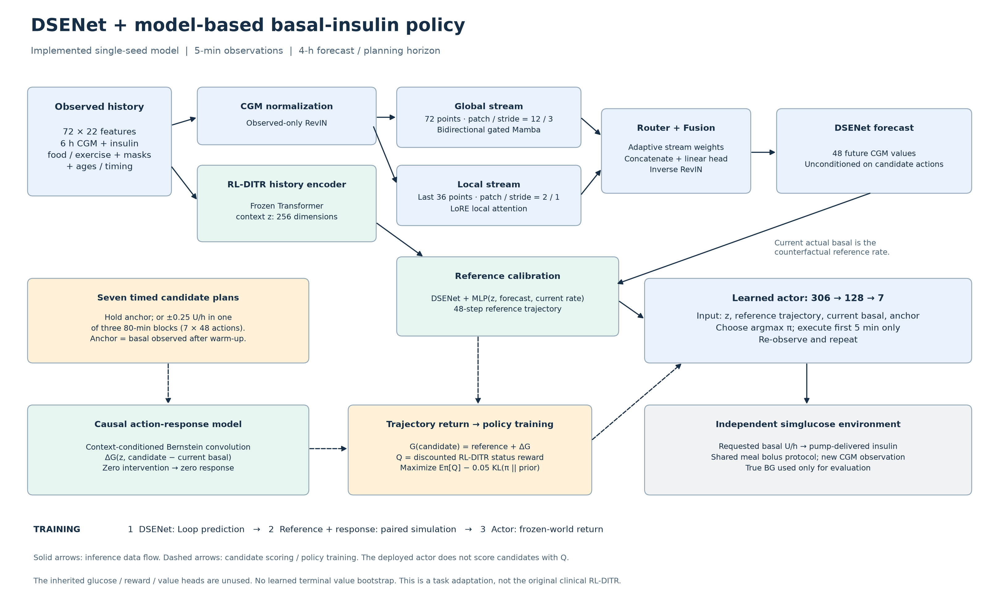

# 当前模型的实际结构与训练状态

这张图对应已经保存的 **P03 预测器＋D05 患者模型＋D06 策略**，不是拟议结构。准确名称是“基于 RL-DITR 思路的 DSENet 模型式基础输注策略”。它保留了方法上的患者动态模型和策略优化思想，但不是原论文临床任务、动作空间和训练器的逐项复现。

## 从输入到动作

输入是过去 **6 小时、每 5 分钟一格的 72×22 历史**。其中包含 CGM、胰岛素、稀疏饮食/运动及缺失标记、记录年龄、时间等信息。两条编码路径处理的信息不同：

- **DSENet 预测路径只读取 CGM 及其有效标记。** 先恢复物理单位，再对实际观测做可逆标准化。全局流读取 72 点，采用双向 gated Mamba，patch 长度 **12**、stride **3**；局部流读取最近 36 点，采用 LoRE，patch 长度 **2**、stride **1**。Router 与 Fusion 融合后输出未来 **48 点，即 4 小时**的 CGM。以上四个 patch 参数是验证集选择出的配置；代码默认参数仍是旧试验值，实际加载的是 checkpoint 的配置。
- **历史上下文路径读取全部 22 个特征。** 使用此前 H02 模型的冻结 Transformer 编码器，输出 256 维上下文 `z`。只调用其编码函数；继承文件中的旧血糖、奖励和价值预测头没有参与当前轨迹打分。

DSENet 自身没有把候选胰岛素动作作为输入，因此它的预测不能直接当作“改变胰岛素后的结果”。当前患者模型增加两个小模块：

1. **参考轨迹校准 MLP**：输入 `z`、DSENet 预测和最近实际输注基础率，对预测加残差，得到以该实际基础率为参考的轨迹。
2. **因果动作响应模块**：根据 `z` 与“候选动作－当前实际基础率”，预测相对于参考轨迹的血糖变化。候选动作等于参考动作时响应严格为零；后面的动作不会影响前面的预测时点。

两部分相加得到候选动作轨迹。使用 RL-DITR 的血糖状态奖励计算 4 小时折扣回报，不接原来的末端价值网络。

## 策略如何训练、实际如何运行

策略是一个小 MLP：**306→128→7**。输入为 256 维 `z`、48 点参考轨迹、当前实际基础率以及一个持续参考基础率。输出是七个候选计划的概率。

七个计划为：保持参考基础率；或者在三个 80 分钟块中的某一个块增加/减少 **0.25 U/h**。参考基础率在仿真 6 小时预热结束时，从已经实际输注的记录中读取并固定。它不是通过接口直接传给网络的患者隐藏 nominal 参数；但预热由 nominal 基础输注完成，所以它仍是一项很强的初始先验，必须在实验设置中说明。

训练时，对七个候选计划计算冻结患者模型的回报，更新策略以增大期望回报，并加入 `0.05 × KL(策略 || 初始先验)` 约束。**这一步是强化学习目标，不是单纯预测 MSE。** 同时，它是有限时域、有限候选的模型式策略优化，不应写成复现了原版 RL-DITR 的完整 actor–critic。

实际部署仿真时，actor 选概率最高的计划，**只执行第一个 5 分钟动作**，再读新 CGM 并重新决策；不会把 4 小时计划一次性开放执行。七个未来计划在当前时刻只对应三种可能基础率：参考值、参考值减 0.25、参考值加 0.25 U/h。actor 推理不逐个计算候选 Q；逐候选评分属于模型训练或另列的 planner 消融。

## “RL 已经训完了吗”的准确回答

**当前这一版、这一 seed 的预设训练已经结束，模型文件已保存。** D06 日志记录：seed **260915**，完整遍历 **225 位训练患者、1,653,421 个起点**，共 **6,580 次更新**；训练前后患者模型参数哈希一致，策略参数确实改变。

“完成预设预算”不等于“已证明收敛”，也不等于“性能已达标”。此版本策略只进行了一个完整 epoch；不能从进程退出正常推断已达到最优解。此前控制评估还有个体持续低血糖等问题，此次新增外部基线训练和统一场景评估也已完成，详见论文正文对比报告；训练信息的差异仍限制算法优势归因。

预测器、参考/响应模块、策略分阶段训练：先学 Loop 血糖预测；再用已有配对仿真数据校准动作后果；最后冻结患者模型训练策略。因此必须披露额外仿真监督，并区分“同一控制场景比较”与“相同训练信息比较”。

## 代码与日志证据

- [预测器实现](../forecast_model.py)；[实际 patch 选择](../checks/patch_selection.json)。
- [患者模型与旧头使用边界](../world_model.py)。
- [七个候选及 actor 结构](../policy_bounded.py)。
- [策略训练目标](../train_policy_bounded.py)；[实际单步推理](../bounded_policy_worker.py)。
- [已冻结模型及哈希](../configs/final_freeze.json)；[D06 完成日志](../delivery/job_logs/dsenet-selected-training-development-20260917.log)，末尾的完成事件记录 6,580 次更新和冻结检查。

本说明是结构和训练状态核查，不是医学有效性或实际患者准入结论。
